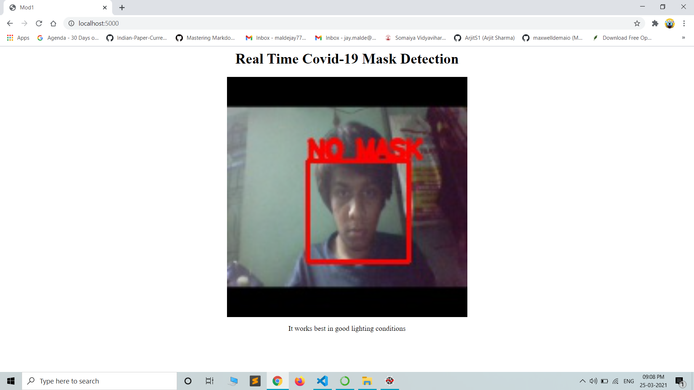
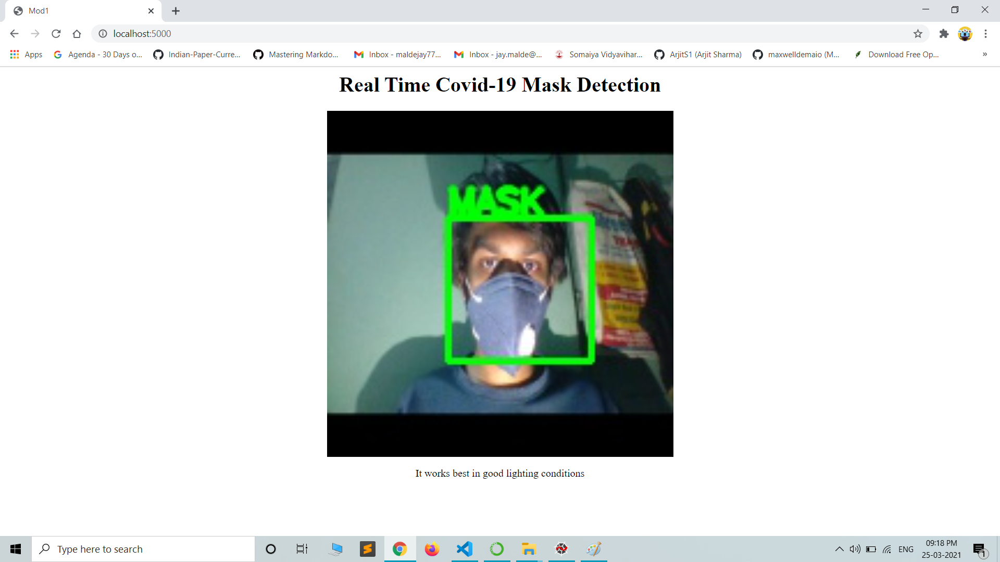

# Realtime_Mask_Detection

## Overview
* A simple flask web application which capture's live video using opencv and shows it in a img tag of html page.
* It captures the frontal face section of the face using haar cascade file.  
* It predicts whether the person has wore a mask using a CNN model which has 92% accuracy.  

### To Generate a model.h5 file use the following [face_mask_detection.ipynb](https://github.com/JayMalde/Realtime_Mask_Detection/blob/main/face_mask_detection.ipynb "face_mask_detection.ipynb") file. 

## Without Mask

## Without Mask

## Some Issues
* I works best when passed images as input in .ipynb file.
* Live Streaming highly depends on camera quality so it may not work. 
